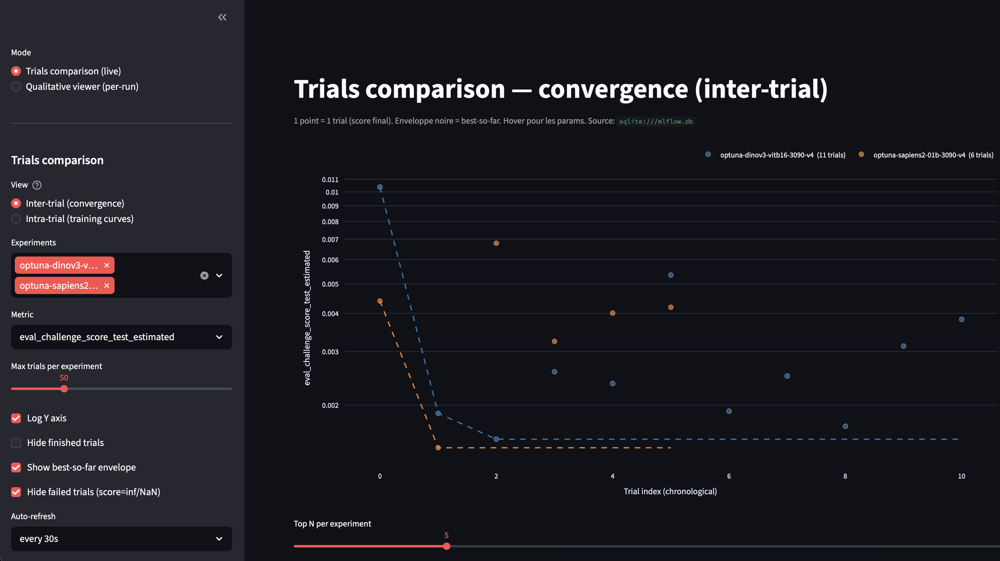
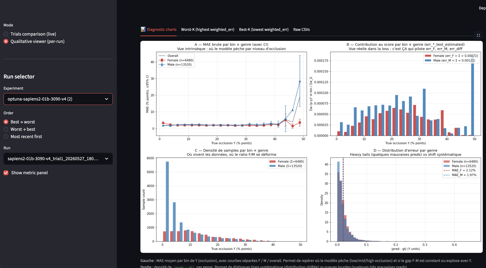
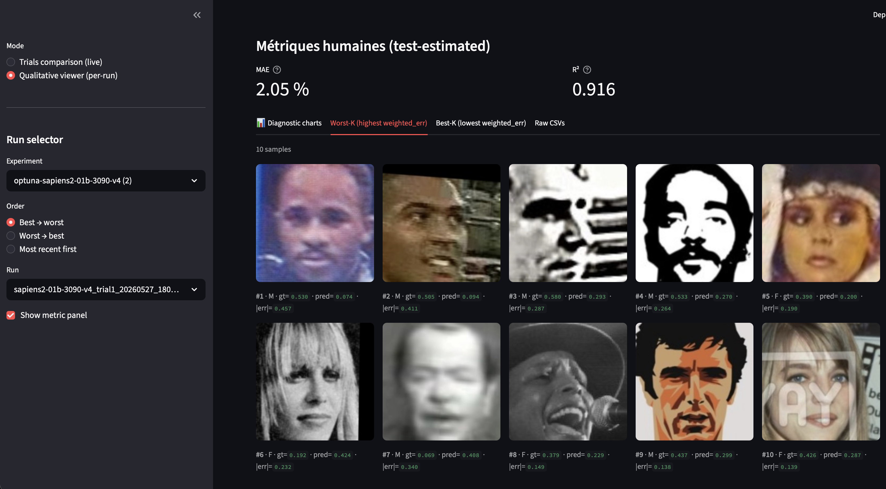

# face-occ-detector


Idemia / Télécom Paris **DataChallenge 2026** — regression of `FaceOcclusion ∈ [0, 1]` (ratio of occluded area to total face area on cropped 224×224 face images). The scoring metric explicitly **penalises gender disparity** between female and male errors.

## v23 — clean rebuild (ported from `../face-occ/faceocc`)

Repartie d'une base propre : le code d'entraînement vient du projet face-occ (boucle PyTorch
simple, transparente), remis dans la structure YAML + scripts d'ici. On garde l'UI, le
pré-entraînement iBOT et l'infra cluster.

- **Modèle** ([`src/models/face_occ_regressor.py`](src/models/face_occ_regressor.py)) : backbone
  (timm ou Sapiens-2) → pooling `mean | attention | grid` (grid fixe 6×6) → head linéaire → sigmoid.
  Le genre n'est **pas** une entrée. `pretrained_source` peut charger un encodeur iBOT (`init_backbone_from`).
- **Loss** ([`src/utils/losses.py`](src/utils/losses.py)) : MSE pondérée par genre `(err_F+err_M)/2 + λ·|err_F−err_M|`
  (= la métrique à λ=1) + **focal légère** ; **Lagrangien** adaptatif log-ratio λ∈[1,2] mis à jour par epoch
  sur le gap val honnête.
- **Reweighting** ([`src/utils/distribution.py`](src/utils/distribution.py)) : IS Y-only sous H_C, `correction_strength`
  partielle à l'entraînement ; **éval = correction complète** via l'estimateur IS-stratifié (26 bins). Val iid
  P_train (15 %). On logue `eval_challenge_score` (IS-strat), `eval_challenge_score_raw`, `err_F/err_M/err_diff`.
- **HPO** ([`src/optimize.py`](src/optimize.py)) : Optuna TPE + Hyperband, search-space YAML, chaînage via
  `load_if_exists`, **torchrun DDP** (rank 0 pilote Optuna, config broadcastée aux workers).

```bash
# entraînement simple
python -m src.train    coatnet3-v23
# HPO 2× 3090 (DDP) — sbatch scripts/optimize_{coatnet3,sapiens2_01b}_v23_2x3090.sh
torchrun --standalone --nproc_per_node=2 src/optimize.py sapiens2-01b-v23
# soumission
python -m src.predict  coatnet3-v23
```

Configs : [`configs/architectures/coatnet3-v23.yaml`](configs/architectures/coatnet3-v23.yaml),
[`configs/architectures/sapiens2-01b-v23.yaml`](configs/architectures/sapiens2-01b-v23.yaml)
(pretraining iBOT dans le HPO).

---

## UI — Streamlit qualitative viewer

L'UI [`scripts/qualitative_viewer.py`](scripts/qualitative_viewer.py) (`inv viewer` ou `streamlit run`) compare les trials Optuna en live et explore les prédictions par run.

**Trials comparison — convergence inter-trial.** 1 point = 1 trial, enveloppe noire = best-so-far, hover pour les params. Slider top-N par famille (Dino / Sapiens / Other), tableau filtrable avec `loss_type`, `pretrained_source`, sampler, etc.



**Diagnostic charts par trial (4 panels).** Panel A : MAE brute par bin × genre avec CI 95 %. Panel B : contribution au score par bin × genre (= ce qui pilote `err_F`/`err_M`). Panel C : densité de samples. Panel D : distribution d'erreur par genre.



**Best / Worst K image gallery.** Vues qualitatives des prédictions extrêmes par trial — utile pour identifier les modes d'échec (heavy tail F, sous-prédiction haut-Y, etc.).



---

## The task

```
Image (224×224 face crop)  →  Model  →  FaceOcclusion ∈ [0, 1]
```

**Loss** (metric-aligned weighted MSE) :
$$L = \frac{\sum_i w_i (p_i - GT_i)^2}{\sum_i w_i}, \qquad w_i = \frac{1}{30} + GT_i$$

**Score** (lower is better) :
$$\text{Score} = \frac{\text{Err}_F + \text{Err}_M}{2} + \left|\text{Err}_F - \text{Err}_M\right|$$

Le poids `w_i = 1/30 + GT_i` donne plus d'importance aux fortes occlusions. Le terme `|Err_F − Err_M|` force la fairness genre. Détails dans [docs/PROJECT.md](docs/PROJECT.md) §1.

---

## Quick start

```bash
# 0. Data (extracted from DataChallenge2026.zip into data/raw/)
ls data/raw/  # train.csv, test_students.csv, database{1,2,3}/

# 1. Environment — single pyproject.toml, CUDA index auto-selected on Linux
uv sync                # local (Mac/CPU/MPS): plain PyPI wheels
                       # cluster (Linux):     CUDA 12.6 wheels via [tool.uv.sources] marker

# 2. Pipeline (declarative — edit CONFIG dicts at top of each src/*.py to switch settings)
inv pretrain           # Stage 0 (optional) — iBOT-light domain adaptation on unlabeled faces
inv train              # Stage 1 — single supervised run, baseline
inv optimize           # Stage 2 — Optuna HPO
inv ensemble           # Stage 3 — k-fold ensemble training on best YAML
inv predict            # Stage 4 — emit test_predictions.csv for submission
inv evaluate           # gender-aware score on a labeled CSV

# UIs
inv mlflow-ui          # http://localhost:5000
inv optuna-dashboard   # http://localhost:8080
inv viewer             # http://localhost:8501  (qualitative_viewer.py — best/worst + diagnostics)
```

---

## Pipeline overview

```
┌──────────────────────────┐   ┌──────────────────────────┐   ┌──────────────────────────┐
│ Stage 0 — iBOT pretrain  │ → │ Stage 1 — HPO (Optuna)   │ → │ Stage 2 — k-fold         │ → predict
│ MS1MV3, frozen teacher   │   │ 3 axes orthogonaux,      │   │ Stratified gender×occ    │
│ snapshots @ 25k/50k/100k │   │ pretrained_source as axis│   │ 5 fold models per arch   │
└──────────────────────────┘   └──────────────────────────┘   └──────────────────────────┘
```

---

## Cluster workflow (SLURM, 2× RTX 3090)

Les 2 yamls v6 (`dinov3-vitb16-3090-v6`, `sapiens2-01b-3090-v6`) intègrent `pretrained_source` en search_space Optuna → le baseline (`lvd` / `sapiens_default`) et les pretrains iBOT custom (`encoder_50000` / `encoder_100000` / `encoder`) sont comparés dans le **même sweep**.

```bash
# 1) Pretrain iBOT custom — les petits modèles tournent à 112 sur MS1MV3-WDS :
sbatch scripts/pretrain_ibot_vitb16_2x3090.sh
sbatch scripts/pretrain_ibot_sapiens2_01b_2x3090.sh

# 2) Récupérer les run_ids et remplir les yaml v6
cat results/pretrain_vitb16/mlflow_run_id.txt               # → ID pour vitb16 v6
cat results/pretrain_sapiens2_01b/mlflow_run_id.txt         # → ID pour sapiens 01b v6
# Remplacer manuellement le run_id dans `search_space.pretrained_source.choices`
# du yaml d'architecture correspondant.

# 3) Lancer l'Optuna v6 — il samplera automatiquement entre baseline et iBOT snapshots
sbatch scripts/optimize_dinov3_vitb16_v6_2x3090.sh
sbatch scripts/optimize_sapiens2_01b_v6_2x3090.sh

# 4) Pour chainer 3 jobs SLURM en INTERLEAVED (les deux archs progressent en parallèle)
./scripts/chain_optimize_two.sh 3 \
    scripts/optimize_dinov3_vitb16_v6_2x3090.sh \
    scripts/optimize_sapiens2_01b_v6_2x3090.sh
```

`train.py` charge l'encodeur sélectionné par Optuna et logue `model_init_backbone_from`, `init_backbone_pretrain_run_id`, tous les `pretrain_*` params, et un tag `pretrain_run_id` pour la traçabilité complète.

---

## Monitoring UIs (MLflow + Optuna) — SLURM workflow

Le gateway `gpu-gw` n'a pas assez de RAM pour faire tourner MLflow UI directement (`Killed` au démarrage). Solution : lancer les UIs sur la partition `CPU` (10 nœuds, 4-day timelimit, pas de QOS GPU) et port-forward depuis ton laptop.

```bash
# Sur le cluster:
./scripts/launch_ui.sh
```

Le script :
1. `sbatch scripts/mlflow_ui.sh` et `scripts/optuna_dashboard.sh` sur la partition `CPU`
2. Poll `squeue` jusqu'à voir les 2 jobs `RUNNING`
3. Extrait les hostnames des nœuds alloués
4. Imprime la commande **`ssh -L ... gpu-gw`** à copy-paste sur ton laptop

Sur ton laptop, après le `ssh -N` (qui reste ouvert) :
- `http://localhost:5000` → MLflow UI
- `http://localhost:8080` → Optuna dashboard

Stop avec `scancel <job-ids>` (le script les imprime).

---

## Branches

- **`main`** — version v1 : `FaceOccRegressor` avec pooling simple (cls / mean / max / attention single-query) + tête MIL auxiliaire
- **`v2-attention-pooling`** — version v2 : K=6 multi-head attention pooling à températures mixtes (focal/diffuse/free), apprises ; tête MIL retirée ; 3 niveaux de régularization
- **`v4-rigorous-balancing`** — v2 archi + équilibrage 3 axes orthogonaux + `pretrained_source` en search_space + quantile matching post-inférence
- **`v6`** (current) — v4 + nouvelles stratégies `gender_within_*` / `cell_within_*` (50/50 F/M intra-bin sans sur-poids des cellules rares) + bornes Optuna resserrées sur signal data v4 ; `dann` retiré (instable) ; v5 retiré (config p100 obsolète)

---

## Project layout

```
src/                  train, optimize, ensemble, pretrain_ibot, predict, evaluate + models/data/utils
configs/architectures/v6 yamls (dinov3 vitb16, sapiens2 0.1b)
scripts/              SLURM sbatch files + chain helpers + UI launchers
docs/PROJECT.md       design & rationale unique (v18)
docs/assets/          screenshots UI
data/                 raw (train.csv, test_students.csv, databases) + pretrain/ + extra/
mlflow.db             SQLite backend MLflow (auto)
optuna_studies/       SQLite per-arch Optuna studies (auto)
```

---

## Where to find what

| Need | Where |
|---|---|
| H_C, fairness, calibration, infra HPO+DDP, roadmap | [docs/PROJECT.md](docs/PROJECT.md) |
| Code clés (losses, distribution, calibrators, gender_classifier, train, optimize) | voir [docs/PROJECT.md §12](docs/PROJECT.md#12-références) |
| Configs HPO | [configs/architectures/*-v18.yaml](configs/architectures/) |
| UI screenshots | [docs/assets/](docs/assets/) |
